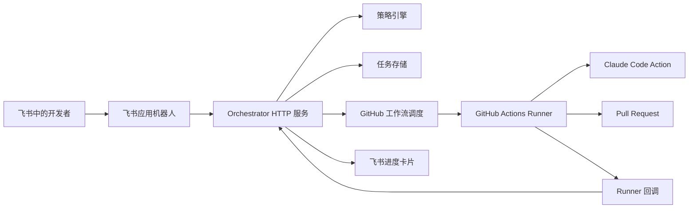

# Claude + 飞书代码自动化

GitHub 仓库：[YNAlone/workAssist](https://github.com/YNAlone/workAssist)

本仓库包含一个基于飞书驱动的代码自动化工作流的最小实现：

1. 飞书应用机器人接收开发者的请求。
2. Orchestrator（编排服务）验证身份、仓库策略和任务风险。
3. GitHub Actions 工作流在隔离的 Runner 中运行 Claude Code。
4. Runner 创建分支、提交变更、推送代码、打开 Pull Request，并回调通知。
5. 飞书接收进度卡片，展示任务状态、PR 链接和审批操作。

默认路径采用保守策略：创建分支和 PR，绝不直接推送到受保护分支。

## 架构



## MVP 能力

- 飞书事件端点，用于接收应用机器人消息事件。
- 飞书卡片操作端点，用于审批和重新运行操作。
- 手动任务端点，用于本地测试或非飞书集成。
- 基于 JSON 的任务存储，便于审计的状态记录。
- 仓库白名单和受保护分支策略。
- 风险分类，对需要审批后才能调度的操作进行管控。
- GitHub 工作流调度集成。
- GitHub Actions 模板：运行 Claude Code、提交、推送、创建 PR 并发送回调。

## 请求格式

优先使用结构化命令，比完全自由形式的指令更易于审计且更安全：

```text
/ai-fix repo=owner/repo branch=main desc="Fix refund rounding bug and add regression tests"
```

支持的字段：

- `repo`：必填，格式为 `owner/repo`。
- `branch`：可选，默认为 `main`。
- `desc`：必填，除非字段之后的剩余文本包含提示词。

## 配置

将 `.env.example` 复制到部署环境并填写相应值。

重要配置项：

- `FEISHU_VERIFICATION_TOKEN`：验证飞书事件和卡片回调。
- `FEISHU_APP_ID` 和 `FEISHU_APP_SECRET`：发送应用机器人进度卡片。
- `FEISHU_BOT_WEBHOOK`：可选的通知回退 Webhook。
- `GITHUB_TOKEN`：在目标仓库中具有工作流调度权限的 Token。
- `GITHUB_WORKFLOW_ID`：目标仓库中的工作流文件名，例如 `feishu-claude.yml`。
- `CALLBACK_BASE_URL`：本 Orchestrator 的公网 URL，供 Runner 回调使用。
- `POLICY_FILE`：仓库策略文件路径，默认为 `config/policy.example.json`。
- `TASK_STORE_PATH`：JSON 任务状态路径，默认为 `data/tasks.json`。

## 本地运行

```bash
python -m feishu_claude_automation.server
```

本地试运行（不调用 GitHub 或飞书 API）：

```bash
AUTOMATION_DRY_RUN=true python -m feishu_claude_automation.server
```

手动创建任务：

```bash
curl -X POST http://localhost:8080/tasks \
  -H 'Content-Type: application/json' \
  -d '{"repo":"owner/repo","base_branch":"main","prompt":"Fix refund rounding bug","requester_id":"demo","chat_id":"oc_demo"}'
```

## GitHub 配置

将 `templates/github/feishu-claude.yml` 复制到每个目标仓库的以下路径：

```text
.github/workflows/feishu-claude.yml
```

添加仓库 Secrets：

- `ANTHROPIC_API_KEY`
- 该仓库所需的任意包注册表或测试凭据。

Orchestrator 会使用 `job_id`、`prompt`、`base_branch`、`work_branch` 和 `callback_url` 作为输入来调度此工作流。

## 飞书配置

使用飞书应用机器人实现交互式自动化：

- 订阅消息接收事件，并指向 `/feishu/events`。
- 将卡片交互回调配置为 `/feishu/actions`。
- 在飞书与 `FEISHU_VERIFICATION_TOKEN` 中使用相同的验证 Token。
- 为应用机器人授予消息发送权限。

自定义机器人 Webhook 仅可作为通知回退使用，因为它无法接收用户命令或卡片回调。

## 安全默认值

- 仅接受策略中列出的仓库。
- 受保护分支不能作为生成的工作分支。
- 高风险提示词在调度 Runner 之前需要明确审批。
- GitHub 工作流会创建 PR，不会自动合并。
- 每个任务在任务存储中保留请求者、提示词、分支、状态、回调、PR URL 和错误详情。
