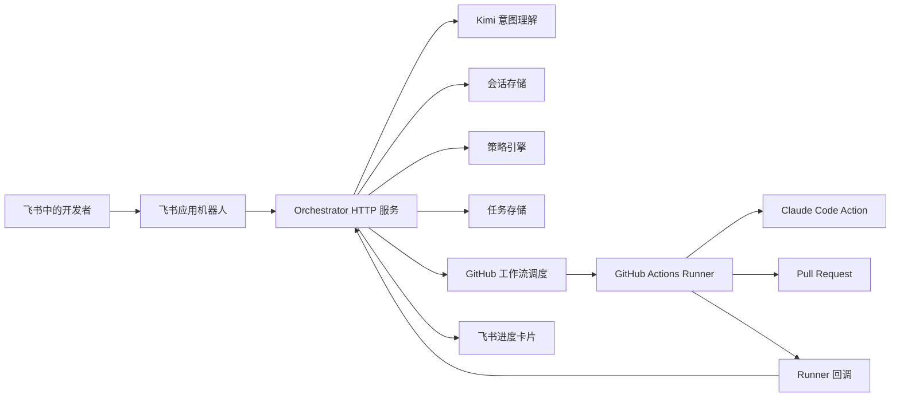

# Claude + 飞书代码自动化

GitHub 仓库：[YNAlone/workAssist](https://github.com/YNAlone/workAssist)

本仓库包含一个基于飞书驱动的代码自动化工作流：

1. 飞书应用机器人接收自然语言或 `/ai-fix` 命令。
2. Orchestrator 调用 Kimi API 做意图理解、多轮澄清，并校验仓库策略与风险。
3. 用户确认后，GitHub Actions 在隔离 Runner 中运行 Claude Code。
4. Runner 创建/更新分支、提交变更、打开或更新 Pull Request，并回调通知。
5. 飞书展示进度卡片；用户可继续对话，在同一分支上迭代修改。

默认路径采用保守策略：创建分支和 PR，绝不直接推送到受保护分支。

## 架构



## 能力

- 自然语言多轮对话：澄清仓库/分支/需求 → 确认计划 → 调度执行。
- PR 创建后可继续回复「再改一下」，在同一工作分支上迭代（`mode=iterate`）。
- 兼容结构化 `/ai-fix` 命令。
- 飞书事件 / 卡片操作 / Runner 回调 / 手动任务端点。
- 仓库白名单、受保护分支、风险审批、并发上限。

## 对话示例

```text
用户：帮我在 workAssist 项目中创建一个 devTT 分支，然后新增 xxx 功能
机器人：计划已整理，请确认…
用户：确认执行
（调度 Claude Code → 创建 PR）
用户：再补一组单元测试
（同一分支 iterate → 更新 PR）
```

## 结构化命令（仍可用）

```text
/ai-fix repo=owner/repo branch=main desc="Fix refund rounding bug and add regression tests"
```

支持的字段：

- `repo`：必填，格式为 `owner/repo`（也支持策略白名单中的短名，如 `workAssist`）。
- `branch`：可选，默认为 `main`。
- `desc`：必填，除非字段之后的剩余文本包含提示词。
- `work_branch`：可选，指定工作分支名。

## 配置

将 `.env.example` 复制到部署环境并填写相应值。

重要配置项：

- `FEISHU_VERIFICATION_TOKEN`：验证飞书事件和卡片回调。
- `FEISHU_APP_ID` 和 `FEISHU_APP_SECRET`：发送应用机器人消息与卡片。
- `FEISHU_BOT_WEBHOOK`：可选的通知回退 Webhook。
- `GITHUB_TOKEN`：在目标仓库中具有工作流调度权限的 Token。
- `GITHUB_WORKFLOW_ID`：目标仓库中的工作流文件名，例如 `feishu-claude.yml`。
- `CALLBACK_BASE_URL`：本 Orchestrator 的公网 URL，供 Runner 回调使用。
- `ORCH_LLM_API_KEY`：Orchestrator 自然语言意图解析用的 Kimi API Key。
- `ORCH_LLM_BASE_URL` / `ORCH_LLM_MODEL`：默认指向 Kimi Coding API。
- `POLICY_FILE`：仓库策略文件路径，默认为 `config/policy.example.json`。
- `TASK_STORE_PATH`：JSON 任务状态路径，默认为 `data/tasks.json`。
- `SESSION_STORE_PATH`：会话状态路径，默认为 `data/sessions.json`。
- `SESSION_TTL_MINUTES`：会话超时分钟数，默认 `120`。

## 本地运行

```bash
PYTHONPATH=src python3 -m feishu_claude_automation.server
```

本地试运行（不调用 GitHub / 飞书 / LLM API）：

```bash
AUTOMATION_DRY_RUN=true PYTHONPATH=src python3 -m feishu_claude_automation.server
```

手动创建任务：

```bash
curl -X POST http://localhost:8080/tasks \
  -H 'Content-Type: application/json' \
  -d '{"repo":"owner/repo","base_branch":"main","prompt":"Fix refund rounding bug","requester_id":"demo","chat_id":"oc_demo"}'
```

## GitHub 配置

将 `templates/github/feishu-claude.yml` 复制到每个目标仓库的以下路径：

```text
.github/workflows/feishu-claude.yml
```

添加仓库 Secrets：

- `ANTHROPIC_API_KEY`
- `GH_PAT`（推荐）：具有 `repo` 权限的 Personal Access Token，用于创建 Pull Request。若未配置，则依赖仓库设置中的「Allow GitHub Actions to create and approve pull requests」选项。
- 该仓库所需的任意包注册表或测试凭据。

在 **Settings → Actions → General → Workflow permissions** 中，还需确保：

- 选择 **Read and write permissions**
- 勾选 **Allow GitHub Actions to create and approve pull requests**（未配置 `GH_PAT` 时必需）

Orchestrator 会使用 `job_id`、`prompt`、`base_branch`、`work_branch`、`callback_url`、`mode` 作为输入来调度此工作流。

## 飞书配置

使用飞书应用机器人实现交互式自动化：

- 订阅消息接收事件，并指向 `/feishu/events`。
- 将卡片交互回调配置为 `/feishu/actions`。
- 在飞书与 `FEISHU_VERIFICATION_TOKEN` 中使用相同的验证 Token。
- 为应用机器人授予消息发送权限。

自定义机器人 Webhook 仅可作为通知回退使用，因为它无法接收用户命令或卡片回调。

## 安全默认值

- 仅接受策略中列出的仓库。
- 受保护分支不能作为生成的工作分支。
- 高风险提示词在调度 Runner 之前需要明确审批。
- GitHub 工作流会创建 PR，不会自动合并。
- 每个任务在任务存储中保留请求者、提示词、分支、状态、回调、PR URL 和错误详情。
- 会话与任务分离存储，超时后自动关闭，避免串话。

## 测试说明

运行 `pytest` 执行全部单元测试，确保变更通过后再提交。
